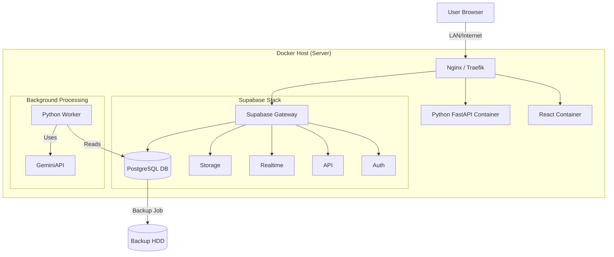

# Hardware Specification & Deployment Plan

> [!IMPORTANT]
> **Key Driver:** The decision to move to a **Self-Hosted Supabase** instance is the primary driver for these hardware requirements. Running a full Supabase stack (Postgres, Realtime, Authentication, Storage, Edge Functions, Kong, Studio, etc.) requires significantly more resources than a simple web app.

## 1. Hardware Specification (Bill of Materials)

Based on the requirement to support **20 active users** (scaling to 100), **Self-Hosted Supabase**, **Python Backend**, and **Background Workers**, we recommend a "Mid-Range Workstation" class server.

### Recommended Specs (The "Sweet Spot")

| Component             | Specification                                                                                    | Reasoning                                                                                                                                                                                        |
| :-------------------- | :----------------------------------------------------------------------------------------------- | :----------------------------------------------------------------------------------------------------------------------------------------------------------------------------------------------- |
| **CPU**               | **Intel Core i5/i7 (12th Gen+) or AMD Ryzen 5/7 (5000+ Series)** Minimum 6 Cores / 12 Threads | Supabase runs ~10+ microservices. Python API and Background workers need dedicated threads. High clock speed benefits Python (GIL).                                                              |
| **RAM**               | **32 GB DDR4/DDR5**                                                                              | **Critical.** Self-hosted Supabase needs ~8GB minimum to breathe. Python ML/Data processing needs ~2-4GB per worker. OS + Caching needs the rest. 16GB is too tight for stability; 32GB is safe. |
| **Storage (Primary)** | **1 TB NVMe SSD (PCIe Gen 4)**                                                                   | Database I/O is the bottleneck. NVMe is mandatory for Postgres performance. 1TB provides ample room for OS, Docker Images, and Data growth for years.                                            |
| **Storage (Backup)**  | **2 TB - 4 TB HDD (Internal or USB 3.0)**                                                        | As requested, a separate drive for backups. HDDs are cheap and reliable for cold storage.                                                                                                        |
| **Network**           | **1 Gigabit Ethernet**                                                                           | Standard. Ensure the server is wired to the main switch/router.                                                                                                                                  |
| **Form Factor**       | **Small Form Factor (SFF) or Tower**                                                             | Fits easily in an air-conditioned Server Room. Ensure good airflow.                                                                                                                              |
| **Power**             | **UPS (Uninterruptible Power Supply)**                                                           | **Essential.** Database corruption on power loss is a real risk. A 1000VA UPS is recommended.                                                                                                    |

---

## 2. Deployment Plan

We will use a **Docker Compose** based architecture. This ensures "Infrastructure as Code" – the entire server setup is defined in a few text files, making it portable and easy to restore.

### A. Architecture Diagram

### A. Storage Growth Projection

**Benchmark Result (146,000 invoices = 1 Year of Data):**

- **Raw Data Size:** 328.49 MB
- **Average Invoice Size:** 2.30 KB
- **Postgres Storage:** ~0.5 GB / year (with indexes & overhead).

**Asset Storage (PDFs):**

- If each invoice has a ~500KB PDF: 146,000 \* 0.5 MB = **~73 GB / year**.

**Conclusion:**
The recommended **1 TB NVMe** is sufficient for **>10 years** of data + assets at this volume. Database storage is negligible; file storage is the main consumer.

### B. Memory (RAM) Analysis

- **Baseline System Load:** Observed ~88-90% RAM usage on the test machine during idle monitoring.
- **Container Footprint:**
  - Supabase (Self-Hosted): Requires minimum **8GB** dedicated.
  - Python Backend (AI/ML): Can spike to **2-4GB** during heavy inference.
  - OS & Filesystem Cache: Needs significant headroom for performance.
- **Conclusion:** **32 GB RAM** is the correct "Sweet Spot".
  - _16 GB_ would be risky (operating near 90% capacity leads to swapping and crashes).
  - _32 GB_ allows for 50-60% utilization, leaving room for buffer spikes and OS caching.

### C. Phase 1: Local Network Deployment

1.  **OS Installation:** Ubuntu Server LTS (Recommended) or Windows Server (if strictly required by infrastructure, though Linux is better for Docker).
2.  **Docker Setup:** Install Docker Engine & Docker Compose.
3.  **Supabase Self-Hosting:**
    - Clone official Supabase Docker repository.
    - Configure `.env` with strong secrets.
    - Start Supabase services.
4.  **Application Deployment:**
    - Create a production `docker-compose.prod.yml` that includes your App and Python Backend.
    - Connect App to local Supabase Container Network.
5.  **DNS/Network:**
    - Set static IP for the server.
    - Configure internal DNS (if available) or host file for `app.internal`.

### D. Phase 2: Public Access (Future)

- **Method:** Cloudflare Tunnel (safest/easiest) or Port Forwarding (requires firewall hardening).
- **Security:** Implement SSL (Let's Encrypt) automatically handled by the Reverse Proxy.

### D. Backup Strategy

- **Strategy:** "3-2-1" Rule (3 copies, 2 media, 1 offsite).
- **Implementation:**
  1.  **Automated Daily Script:** Runs `pg_dump` to export the database.
  2.  **Local Copy:** Saves dump to the **Backup HDD**.
  3.  **Cloud Copy:** Uploads encrypted dump to a cloud storage (AWS S3 Glacier / Google Drive / Azure Blob) for disaster recovery.

---

## 3. Benchmarking Strategy

Since we need concrete numbers for resource usage, we will create a `benchmarks/` directory with the following tests:

### Test 1: Baseline Resource Usage

- **Goal:** Determine RAM/CPU usage of idle vs. active containers.
- **Tool:** `docker stats` + logging script.
- **Action:** Run the full stack (Supabase + App) and record metrics over 1 hour.

### Test 2: Database Growth Simulation

- **Goal:** Estimate disk usage per 1,000 invoices.
- **Tool:** Python Script (`faker` + `sqlalchemy`).
- **Action:** Generate 1,000, 5,000, and 10,000 dummy invoice records. Measure finding database size increase.

### Test 3: Load Testing (Concurrency)

- **Goal:** Simulate 20-50 simultaneous users.
- **Tool:** [Locust](https://locust.io/) (Python-based load testing).
- **Action:** Script simulated user behavior (Upload file -> Parse -> View Result). Run against the local stack and observe latency and crash points.

---

## Next Steps for User

1.  **Approve Hardware Spec:** Does the "Mid-Range Workstation" budget fit?
2.  **Approve Deployment Plan:** Is Docker/Linux acceptable for the server OS?
3.  **Action:** I will begin creating the **Benchmarking Scripts** to gather the missing data points.
